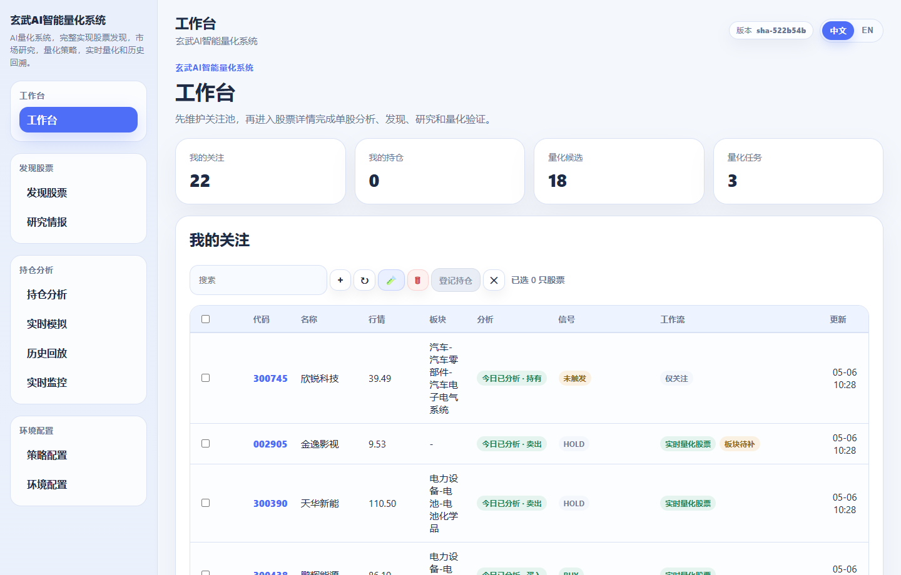
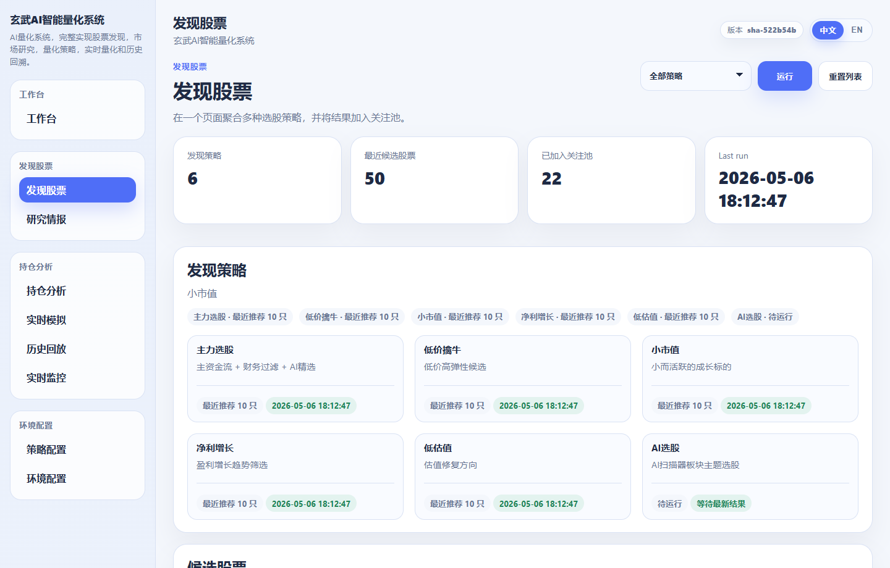
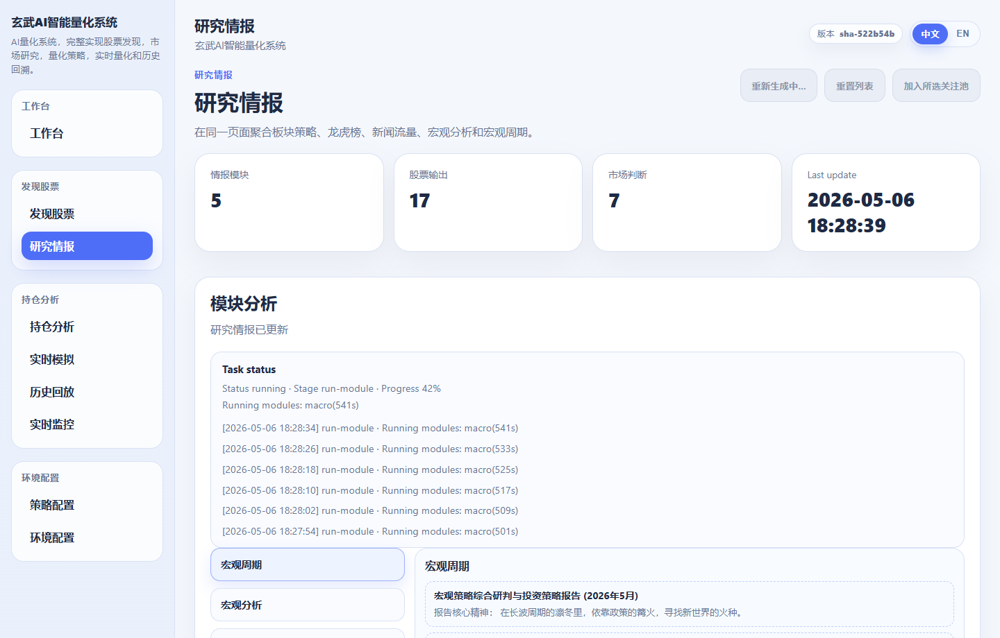
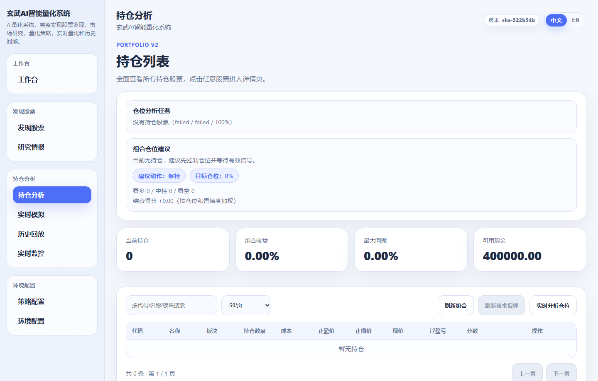
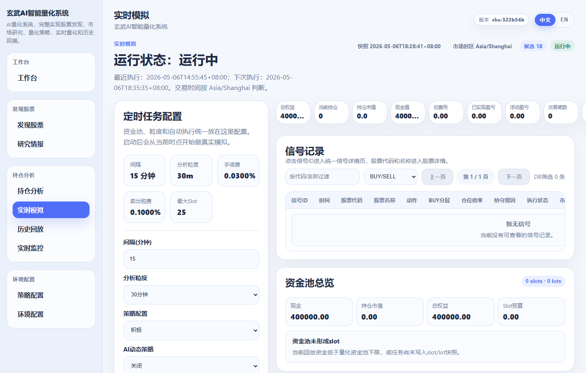
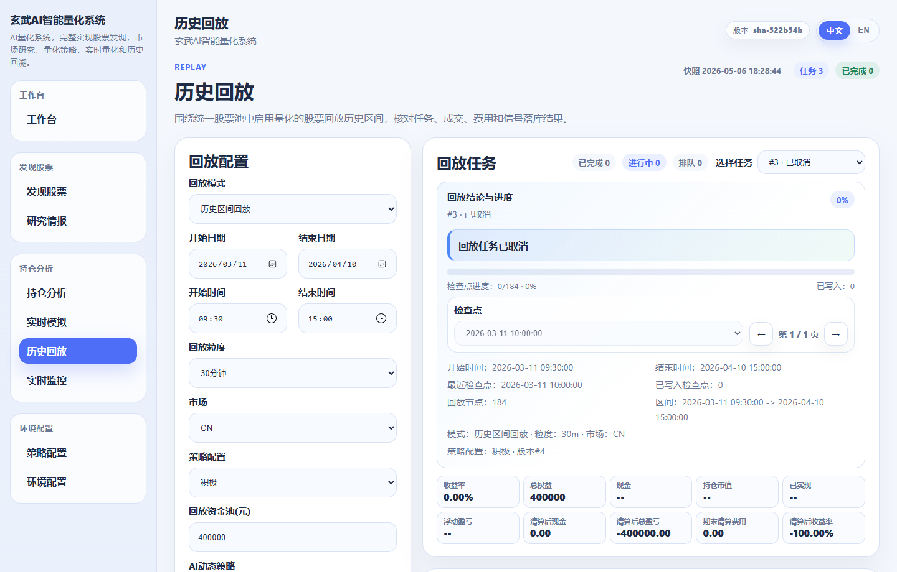
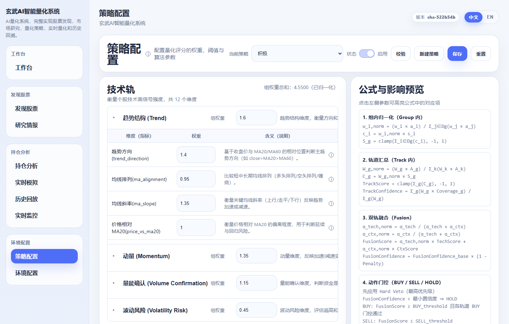
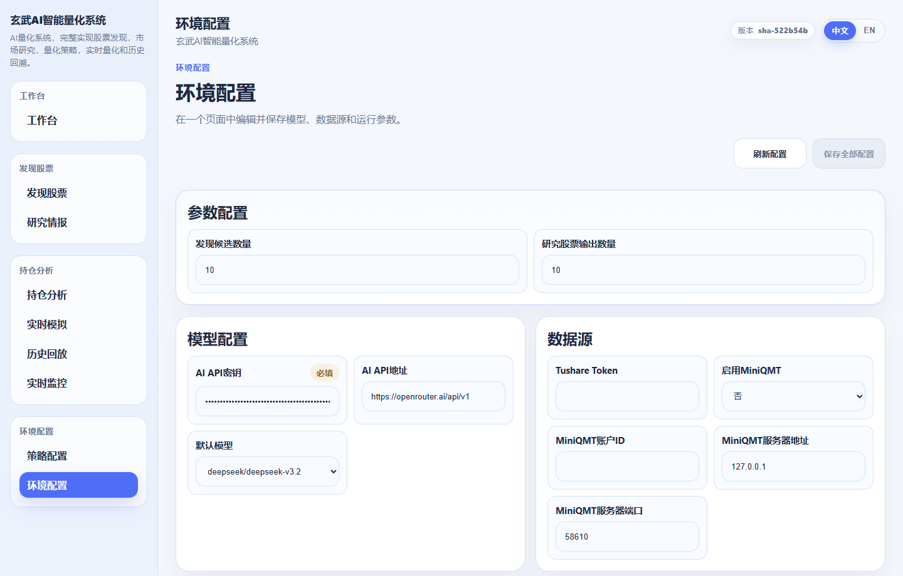

# 玄武量化系统

一套面向 A 股投资研究与策略验证的工作台，把选股、研究、持仓诊断、实时模拟和历史回放放到同一条链路里。

玄武量化系统要解决的不是单点问题，而是整条投资分析链路的割裂问题。很多系统能做选股，很多系统也能看回测，但研究结果、股票池、持仓判断、策略验证和执行反馈往往分散在不同页面、不同表、甚至不同工具里，最后很难回答几个关键问题：这只股票为什么进池、为什么买、为什么没卖、这次亏损到底是行情问题还是策略问题。

这套系统的重点，就是把这些问题放回同一个上下文里处理。你可以从发现股票和研究情报里找到标的，把它们沉淀到统一股票池，再按用途进入持仓诊断、实时模拟和历史回放。这样，研究结论不会和执行过程脱节，策略调整也能直接回到具体股票和具体交易上验证。

当前主流程：

`发现股票 / 研究情报 / 手工录入 -> 统一股票池(stock_universe) -> 按标签筛选 -> 持仓诊断 / 实时模拟 / 历史回放`

## 核心能力

### 1. 统一股票池

系统用 `stock_universe` 作为统一入口。关注、量化扫描、登记持仓都落在同一批股票上，通过标签区分用途。这样做的价值很直接：股票不会在不同模块里各存一份，后续的研究、诊断和模拟都围绕同一份标的集合展开。

### 2. 研究到执行的闭环

发现股票负责给出候选，研究情报补充背景和信号解释，持仓分析负责诊断已有仓位，实时模拟负责验证当前策略，历史回放负责检查策略在历史区间里的行为。几个模块不是平铺的功能页，而是围绕“从研究到验证”这条主线串起来的。

### 3. 面向实盘约束的量化执行

系统不是只给一个买卖点，还把 A 股交易约束和执行细节放进规则里，例如 T+1、lot/slot 资金分配、止盈回撤、止损、连续失败冷却、再入场降仓、组合级防守等。这些规则同时作用在实时模拟和历史回放里，便于用同一套逻辑检查策略是否站得住。

### 4. 本地优先的数据架构

实时行情、技术指标、历史 K 线、回放结果分别管理。实时模拟写 live 库，历史回放写 replay 库；历史数据优先读本地缓存，缺失时再补远端，减少重复拉取、重复计算和无效写库。

## 适用场景

- 想把分散的选股结果沉淀成一套可持续维护的股票池
- 想对当前持仓做结构化诊断，而不是只看盈亏和涨跌
- 想在不接实盘的前提下验证策略信号、仓位规则和组合防守
- 想复盘一段历史行情里，策略为什么买、为什么卖、为什么会亏
- 想让研究、策略配置、执行反馈在一套系统里持续闭环

---

## 界面预览

<table>
  <tr>
    <td width="33%">
      <strong>工作台</strong><br/>
      
    </td>
    <td width="33%">
      <strong>发现股票</strong><br/>
      
    </td>
    <td width="33%">
      <strong>研究情报</strong><br/>
      
    </td>
  </tr>
  <tr>
    <td width="33%">
      <strong>持仓分析</strong><br/>
      
    </td>
    <td width="33%">
      <strong>实时模拟</strong><br/>
      
    </td>
    <td width="33%">
      <strong>历史回放</strong><br/>
      
    </td>
  </tr>
  <tr>
    <td width="50%">
      <strong>策略配置</strong><br/>
      
    </td>
    <td width="50%">
      <strong>环境配置</strong><br/>
      
    </td>
  </tr>
</table>

---

## 快速启动

### 1. 安装依赖

```bash
pip install -r requirements.txt
```

### 2. 配置 `.env`

```bash
copy .env.example .env
```

最低建议配置：

```env
DEEPSEEK_API_KEY=your_api_key
TDX_ENABLED=true
```

### 3. 启动后端

```bash
python app.py
```

默认后端地址：

- `http://127.0.0.1:8501/api/health`

### 4. 启动前端开发环境

```bash
cd ui
npm install
npm run dev
```

前端开发地址：

- `http://127.0.0.1:4173`

---

## 当前数据边界

### 统一股票池

- 主库：`data/quant_sim.db`
- 主表：`stock_universe`

关键标签：

- `watched`
- `quant_enabled`
- `registered_position_enabled`

### 实时量化

- 写入 `quant_sim.db` 的 live 状态表
- 典型表：`strategy_signals / sim_positions / sim_trades / sim_account`

### 历史回放

- 写入 `data/quant_sim_replay.db`
- 典型表：`sim_runs / sim_run_signals / sim_run_trades / sim_run_positions`

### 发现与研究缓存

- `data/selector_results/*.json`

---

## 推荐阅读

- [docs/README.md](docs/README.md)
- [docs/QUICK_START.md](docs/QUICK_START.md)
- [docs/工作台工作流指南.md](docs/工作台工作流指南.md)
- [docs/股票数据流说明.md](docs/股票数据流说明.md)
- [docs/量化交易快速指南.md](docs/量化交易快速指南.md)
- [docs/前端页面与交互清单.md](docs/前端页面与交互清单.md)
- [docs/后端能力与服务接口清单.md](docs/后端能力与服务接口清单.md)
- [docs/superpowers/specs/2026-05-05-stock-universe-refresh-architecture-design.md](docs/superpowers/specs/2026-05-05-stock-universe-refresh-architecture-design.md)
