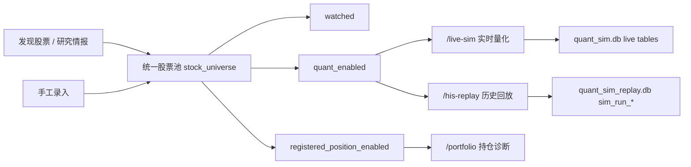

# 工作流与数据流说明

本文档描述当前代码里的真实数据流，不再使用旧的 `watchlist.db -> candidate_pool -> portfolio_stocks.db` 口径。

## 1. 总览

当前系统的数据中心已经收敛到三个主要持久化边界：

1. `quant_sim.db`
   - 股票池主表 `stock_universe`
   - 实时量化账户、持仓、成交、信号
   - 策略配置

2. `quant_sim_replay.db`
   - 历史回放任务和结果

3. `data/selector_results/*.json`
   - 发现股票和研究情报的最新结果缓存

## 2. 主工作流

## 3. 股票池主对象

股票池主对象是 `quant_sim.db.stock_universe`。

它统一承接：

- 手工添加股票
- 发现股票写入
- 研究情报写入
- 实时量化启用状态
- 登记持仓状态

当前默认工作台列表读取条件是：

`watched = 1 OR quant_enabled = 1 OR registered_position_enabled = 1`

这正是 review 里提到的“工作台要展示完整股票池视图”的当前实现。

## 4. 发现股票和研究情报

发现股票与研究情报当前不直接写 live-sim 或 replay 结果库。

它们的结果先落在：

- `data/selector_results/main_force.json`
- `data/selector_results/low_price_bull.json`
- `data/selector_results/small_cap.json`
- `data/selector_results/profit_growth.json`
- `data/selector_results/value_stock.json`
- `data/selector_results/research.json`

页面展示时，还会叠加：

- `data/selector_results/stock_runtime_snapshot.json`

这个 runtime snapshot 由统一刷新链路维护，用来给发现/研究页面补最新价和名称。

## 5. 工作台

工作台页面 `/main` 读取的是统一股票池视图，而不是旧 `watchlist` 表。

主要动作：

1. `add-watchlist`
   - 手工录入股票
   - 写入 `stock_universe`
   - 若基础信息未知，写 `basic_info_missing=true`

2. `batch-quant`
   - 将股票标记为 `quant_enabled=1`

3. `batch-portfolio`
   - 将股票标记为 `registered_position_enabled=1`
   - 写入登记持仓字段

4. `delete-watchlist`
   - 删除 `watched` 视角

当前 `refresh-watchlist` 已停用，后端直接返回错误，避免回到旧的旁路行情刷新。

## 6. 实时量化

`/live-sim` 默认从统一股票池里读取：

- `quant_enabled=1`
- 可选 `status=active`

底层仍通过 `CandidatePoolService` 访问，但它现在只是 `stock_universe.quant_enabled` 的兼容服务层，不再代表独立物理候选池表。

实时量化运行结果写入 `quant_sim.db`：

- `strategy_signals`
- `sim_positions`
- `sim_position_lots`
- `sim_trades`
- `sim_account`
- `sim_account_snapshots`
- `sim_capital_slots`
- `sim_lot_slot_allocations`
- `sim_scheduler_config`

当前默认调度周期是 `10` 分钟，不是旧文档里的 `15` 分钟。

## 7. 历史回放

`/his-replay` 在启动任务时冻结统一股票池中 `quant_enabled=1` 的股票范围。

当前只支持：

- `POST /api/v1/quant/his-replay/actions/start`
- `POST /api/v1/quant/his-replay/actions/cancel`
- `POST /api/v1/quant/his-replay/actions/delete`

不再支持：

- `actions/continue`
- “从过去接续到当前模拟账户”

历史回放结果只写 `quant_sim_replay.db`，不写 live-sim 状态表。

## 8. 持仓诊断

`/portfolio` 的主要数据源也是 `stock_universe`，通过 `registered_position_enabled` 和登记持仓字段筛选。

这意味着：

- 登记持仓是股票池标签和字段，不是独立股票主表
- 个股详情页、持仓诊断列表、工作台三者共享同一个股票主对象

## 9. 刷新和缓存

当前实现里最重要的刷新口径：

1. 实时 quote TTL 为 `2` 分钟。
2. stock refresh scheduler 对 fresh entry 直接命中本地，不重复远程。
3. 远程失败股票进入冷却。
4. 历史回放数据准备走 local-first。
5. 历史回放 checkpoint 阶段只读准备结果。

当前历史回放 30m 数据准备还做了两层优化：

1. 空区间/空股票的负缓存，避免反复远程探测。
2. 默认 90 天 intraday segment，避免一年区间被切成过多碎片。

## 10. 当前代码与旧文档最大的差异

以下旧说法已经不成立：

- 工作台只展示 `watched=1`
- `watchlist.db` 是主关注池数据库
- `candidate_pool` 是独立量化池主表
- 实时量化默认 15 分钟
- 历史回放支持 continue 到 live-sim
- 历史回放结果写 live-sim 状态表

## 11. 结论

如果需要判断某个页面“到底从哪里读、往哪里写”，以这条规则为准：

- 股票主对象：`quant_sim.db.stock_universe`
- 实时量化执行状态：`quant_sim.db`
- 历史回放执行结果：`quant_sim_replay.db`
- 发现/研究结果缓存：`data/selector_results/*.json`
