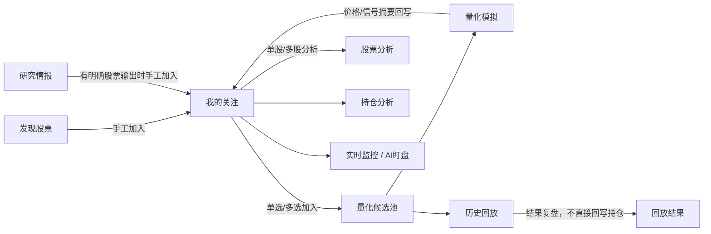

# 工作流与数据流说明

本文档描述当前系统的主工作流和数据流，目标是把“页面怎么走、数据怎么流、写到哪里、结果从哪里读”说清楚。

## 1. 当前主工作流

当前推荐主线是：

`发现股票 / 研究情报 -> 我的关注 -> 量化候选池 -> 量化模拟 / 历史回放`

这条主线的角色分工如下：

- `发现股票`：负责筛出候选股票
- `研究情报`：负责给出板块、市场、资金、新闻、宏观类研究；只有有明确股票输出时才支持加入“我的关注”
- `我的关注`：全局主池，承接你真正关心的股票
- `量化候选池`：从“我的关注”人工推入，用于量化模拟和历史回放
- `量化模拟 / 历史回放`：围绕量化候选池做执行、验证和复盘

## 2. 工作流图

## 3. 数据流 1：发现股票 -> 我的关注

### 3.1 数据来源

发现股票页内部各策略模块会生成结果表：

- 主力选股
- 低价擒牛
- 小市值
- 净利增长
- 低估值

这些结果通常先存在：

- 当前页面的 `st.session_state`
- 对应策略的最近一次结果文件（如 `data/selector_results/*.json`）

### 3.2 用户动作

用户在策略页里：

- 单只点击 `⭐ 加入关注池`
- 或者在候选结果表中勾选后批量加入

### 3.3 中间处理

桥接层：

- [watchlist_selector_integration.py](/C:/Projects/githubs/aiagents-stock/watchlist_selector_integration.py)

核心处理包括：

- 股票代码标准化
- 提取价格
- 提取来源策略
- 提取附加元数据

### 3.4 落库位置

最终写入：

- [watchlist.db](/C:/Projects/githubs/aiagents-stock/watchlist.db)

核心表：

- `watchlist`

### 3.5 页面读取位置

工作台首页：

- [watchlist_ui.py](/C:/Projects/githubs/aiagents-stock/watchlist_ui.py)

### 3.6 典型失败点

- 结果页没有提供“加入关注池”入口
- 原始结果表过大，候选表没收敛，导致用户不知道该选哪些
- 股票名称或价格提取失败，只能先用代码入池

## 4. 数据流 2：研究情报 -> 我的关注

### 4.1 数据来源

研究情报模块包括：

- 智策板块
- 智瞰龙虎
- 新闻流量
- 宏观分析
- 宏观周期

不是所有模块都会生成股票列表。

### 4.2 用户动作

仅当模块里有明确股票输出时，用户才会看到：

- 单只 `⭐ 加入关注池`
- 或 `⭐ 批量加入关注池`

### 4.3 中间处理

桥接层：

- [research_watchlist_integration.py](/C:/Projects/githubs/aiagents-stock/research_watchlist_integration.py)

### 4.4 落库位置

同样写入：

- `watchlist.db`

### 4.5 页面读取位置

工作台首页 `我的关注`

### 4.6 典型失败点

- 模块本身只有研究结论，没有结构化股票列表
- 研究输出字段命名不一致，导致股票代码或名称抽取失败

## 5. 数据流 3：我的关注 -> 股票分析

### 5.1 数据来源

“我的关注”里的股票来自：

- 手工添加
- 发现股票结果
- 研究情报结果

### 5.2 用户动作

在工作台首页的股票分析模块中：

- 输入股票代码
- 或者后续可以由“我的关注”选中后带入代码

### 5.3 中间处理

主页分析主流程会调用：

- `StockDataFetcher`
- `StockAnalysisAgents`
- 团队讨论与最终决策链路

### 5.4 落库位置

分析历史主要由主页面历史记录系统维护，不写回 `watchlist.db` 作为完整结果存储。

### 5.5 页面读取位置

- 工作台首页 `股票分析`
- 历史记录页

## 6. 数据流 4：我的关注 -> 量化候选池

### 6.1 数据来源

首页 `我的关注` 表格中的股票。

### 6.2 用户动作

两种方式：

- 行内 `🧪`
- 批量工具条 `🧪`

### 6.3 中间处理

调用：

- `candidate_pool_service.add_candidate(...)`
- `WatchlistService.mark_in_quant_pool(...)`
- `WatchlistService.sync_quant_membership(...)`

### 6.4 落库位置

量化库：

- `quant_sim.db`

核心表：

- `candidate_pool`
- `candidate_sources`

关注池同步字段：

- `watchlist.in_quant_pool`

### 6.5 页面读取位置

- 工作台首页 `我的关注`
- 量化模拟页 `候选池`
- 历史回放页左侧候选池摘要

### 6.6 典型失败点

- 关注池全选/批量逻辑失效
- 候选池成员关系没同步回关注池
- 候选池表里没有名称或价格，需要后续刷新补齐

## 7. 数据流 5：量化候选池 -> 量化模拟

### 7.1 数据来源

量化候选池：

- `quant_sim.db.candidate_pool`

### 7.2 用户动作

在量化模拟页中：

- 配置策略模式、粒度、市场、自动执行、资金池
- 启动模拟
- 或单只打开候选股分析详情

### 7.3 中间处理

核心链路：

1. `QuantSimScheduler.run_once()`
2. `engine.analyze_active_candidates(...)`
3. `signal_center_service.create_signal(...)`
4. `portfolio_service.auto_execute_signal(...)`

### 7.4 落库位置

量化库：

- `strategy_signals`
- `sim_positions`
- `sim_position_lots`
- `sim_account`
- `sim_trades`
- `sim_account_snapshots`
- `sim_scheduler_config`

### 7.5 页面读取位置

- 量化模拟页 `执行中心`
- 量化模拟页 `账户结果`
- 工作台首页 `我的关注` 的价格和信号摘要

### 7.6 回写到我的关注

量化模拟在执行时会把这些摘要回写到 `watchlist.db`：

- 最新价格
- 最新量化信号
- 股票名称补全

### 7.7 典型失败点

- 自动执行开启，但没有 BUY/SELL
- BUY 因 A 股一手规则被跳过
- 价格缺失导致自动执行跳过
- 服务重启后调度未恢复

## 8. 数据流 6：量化候选池 -> 历史回放

### 8.1 数据来源

同样来自量化候选池。

### 8.2 用户动作

在历史回放页中：

- 选择回放模式
- 选择开始/结束时间
- 选择粒度、市场、策略模式
- 点击 `回放` 或 `接续`

### 8.3 中间处理

核心链路：

1. `QuantSimReplayService.enqueue_historical_range(...)`
2. `replay_runner` 启动后台 worker
3. 历史快照 provider 拉取历史数据
4. 逐 checkpoint 生成信号
5. 执行回放成交
6. 写回 run 结果

### 8.4 落库位置

量化库：

- `sim_runs`
- `sim_run_checkpoints`
- `sim_run_signals`
- `sim_run_trades`
- `sim_run_snapshots`
- `sim_run_positions`
- `sim_run_events`

### 8.5 页面读取位置

- 历史回放页任务列表
- 历史回放页结果面板

### 8.6 典型失败点

- 历史数据源中断
- worker 进程异常退出
- 某些股票历史价格缺失
- 大量 `HOLD` 导致用户误判为“没有执行信号”

## 9. 数据流 7：量化模拟结果 -> 我的关注

### 9.1 目的

让工作台首页的“我的关注”不仅是静态股票池，而是能看到：

- 最新价格
- 最新信号
- 是否已在量化候选池

### 9.2 回写内容

回写字段包括：

- `latest_price`
- `latest_signal`
- `stock_name`
- `updated_at`

### 9.3 当前效果

用户在首页可以直接看到：

- 最新价
- 来源
- 当前状态
- 是否已入量化池

## 10. 持仓分析 / 实时监控 / AI盯盘的位置

这三块不在主线里，但和主线强相关：

### 10.1 持仓分析

定位：

- 已持仓股票的专用分析入口

区别于“我的关注”：

- 我的关注是潜在关注对象
- 持仓分析是已买入对象

### 10.2 实时监控

定位：

- 规则式监控和通知

### 10.3 AI盯盘

定位：

- 更连续、更智能的单票分析与任务化跟踪

这三者都可以从工作台右侧“下一步”进入。

## 11. 为什么当前系统会让人觉得“数据流乱”

根因主要有 4 个：

1. 发现股票结果以前更多停留在各策略页内部
2. 关注池和量化候选池的职责容易混淆
3. 研究情报不是天然股票列表，但有时又能输出股票
4. 当前是 Streamlit 页面直调 Python 服务，页面和服务之间的边界需要在重构时保持稳定

本轮重构后的主线已经尽量压成：

`发现股票 / 研究情报 -> 我的关注 -> 量化候选池 -> 量化模拟 / 历史回放`

## 12. 建议的重构优先级

为了降低风险，建议按下面顺序迁移：

1. `我的关注` 和工作台首页
2. `发现股票` 聚合页
3. `研究情报` 聚合页
4. `量化模拟`
5. `历史回放`
6. `持仓分析 / 实时监控 / AI盯盘`

原因：

- 主线先稳定
- 候选池和量化池关系先固定
- 回放和模拟后调整，能复用前面已经稳定下来的数据流
