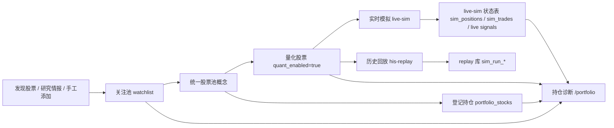

# 股票数据流说明

Date: 2026-05-05

## 目标

本文统一说明应用内股票数据从发现、关注、量化、持仓诊断、实时模拟到历史回放的流转关系。核心原则：

1. 用户只维护一批股票对象，系统按用途打标签。
2. 股票范围可以共享，仓位和账户口径必须隔离。
3. `portfolio` 登记持仓、`live-sim` 模拟持仓、`his-replay` 回放持仓是三套不同仓位口径。
4. 实时模拟和历史回放可以使用同一批量化股票，但执行结果不能互相写库。

## 名词定义

| 产品名称 | 当前实现名 | 含义 |
|---|---|---|
| 关注池 | `watchlist` | 用户从发现、研究、手工添加进入系统的股票集合。它是股票进入系统的主要入口。 |
| 股票池 | 目标统一概念，目前分散在 `watchlist`、`candidate_pool`、`portfolio_stocks` 中 | 系统统一标的集合，按股票代码去重。 |
| 量化股票 | 当前 `candidate_pool` + `watchlist.in_quant_pool` | 被允许用于实时模拟和历史回放的股票范围。 |
| 登记持仓 | `portfolio_stocks` | 用户登记的真实/外部持仓口径，用于持仓诊断。 |
| 实时模拟持仓 | `sim_positions` | live-sim 独立模拟账户持仓。 |
| 历史回放持仓 | `sim_run_positions` | his-replay 单个回放任务内的最终持仓快照。 |
| 实时模拟信号 | live signal tables / `strategy_signals` 等实时口径 | live-sim 生成和展示的信号。 |
| 历史回放信号 | `sim_run_signals` | 回放任务内的信号摘要，带 `run_id`。 |

## 总体数据流

## 关注池与股票池

关注池是用户操作入口，股票池是系统底层统一概念。

当前实现中还没有单独的 `stock_universe` 表，股票主对象分散存在：

1. `watchlist.db.watchlist`
2. `quant_sim.db.candidate_pool`
3. `portfolio_stocks.db.portfolio_stocks`
4. live-sim 的 `sim_positions`
5. replay 的 `sim_run_positions`

目标上应按股票代码统一合并为一个股票诊断视图，但不要求立刻物理合表。短期可以通过 API 聚合实现统一股票池视图。

### 关注池职责

关注池表达“我要持续跟踪这只股票”。

来源：

1. 发现股票页面加入关注。
2. 研究情报页面加入关注。
3. 工作台手工添加。
4. 登记持仓时自动加入。

关注池不等于持仓，也不等于量化股票。

## 量化股票

量化股票表示“这只股票允许被策略扫描并生成信号”。

当前实现：

1. `candidate_pool` 保存量化候选。
2. `watchlist.in_quant_pool=true` 标记关注池股票已经加入量化候选。

目标产品命名：

1. 底层叫 `量化股票`。
2. live-sim 页面叫 `实时量化股票`。
3. his-replay 页面叫 `回放股票范围`。
4. 操作按钮叫 `加入量化` / `移出量化`。
5. 状态标签叫 `量化股票`。

### 批量操作规则

量化股票管理不应在表格每一行右侧放单独按钮作为主操作。应在列表上方提供批量操作：

1. 勾选股票。
2. 点击 `加入量化`。
3. 点击 `移出量化`。
4. 批量结果返回成功数、失败数和失败原因。

行内可以展示状态标签，但不作为主要管理入口。

## 登记持仓

登记持仓是用户真实/外部账户持仓口径，用于持仓诊断。

登记规则：

1. 工作台登记持仓时，股票必须自动加入关注池/统一股票池。
2. 登记时可以输入持仓数量、成本、止盈、止损。
3. 登记时也可以只输入股票，不输入数量。
4. 数量大于 0 时，参与持仓诊断的组合仓位、浮盈亏、集中度和风险标签计算。
5. 数量为空或 0 时，只作为观察/分析股票，不参与组合持仓计算。
6. 登记持仓股票默认加入量化股票，用于持续产生信号和风险提示。

登记持仓不会自动写入 live-sim 持仓。

## 实时模拟

实时模拟是独立模拟账户。它使用量化股票作为扫描范围，但使用自己的账户状态执行交易。

读取：

1. 量化股票列表。
2. 策略配置。
3. live-sim 自己的 `sim_positions`、`sim_trades`、资金槽和账户快照。
4. 行情和指标缓存。

写入：

1. live-sim 信号。
2. `sim_positions`
3. `sim_trades`
4. `sim_account`
5. `sim_account_snapshots`
6. `sim_capital_slots`
7. `sim_lot_slot_allocations`

实时模拟不应隐式继承登记持仓数量。需要支持显式操作：

1. `导入登记持仓到实时模拟`
2. `手动设置模拟持仓`
3. `清空实时模拟持仓`

导入后，登记持仓和实时模拟持仓继续独立变化。

## 历史回放

历史回放默认使用量化股票作为回放股票范围，也可以在任务级做临时筛选。

读取：

1. 量化股票列表。
2. 回放任务配置。
3. 策略配置。
4. 历史行情和指标缓存。

写入：

1. replay 库的 `sim_runs`
2. `sim_run_checkpoints`
3. `sim_run_trades`
4. `sim_run_snapshots`
5. `sim_run_positions`
6. `sim_run_signals`
7. `sim_run_signal_details`
8. `sim_run_events`

历史回放不得写入 live-sim 的：

1. `sim_positions`
2. `sim_trades`
3. `sim_account`
4. `sim_account_snapshots`
5. `sim_capital_slots`

## 持仓诊断

`/portfolio` 是统一股票诊断页。它展示一个按股票代码去重的诊断列表，合并以下来源：

1. 关注池。
2. 量化股票。
3. 登记持仓。
4. 实时模拟持仓。
5. 分析缓存。

合并展示不等于口径混用。同一股票在一行中可以同时展示：

1. 登记持仓数量、成本、市值、浮盈亏。
2. live-sim 持仓数量、成本、市值、浮盈亏。
3. 是否量化股票。
4. 是否关注。
5. 最新信号。
6. 分析结论。

组合诊断默认只统计登记持仓数量大于 0 的股票。live-sim 持仓只作为执行账户引用，不参与登记持仓组合收益和集中度计算。

## 账户口径隔离

| 口径 | 读写位置 | 用途 | 是否参与持仓诊断组合计算 |
|---|---|---|---|
| 登记持仓 | `portfolio_stocks.db` | 用户真实/外部持仓诊断 | 是，数量大于 0 时参与 |
| 实时模拟持仓 | `quant_sim.db.sim_positions` | live-sim 模拟交易账户 | 否，只作为引用 |
| 历史回放持仓 | `quant_sim_replay.db.sim_run_positions` | 单次回放结果 | 否，只在回放任务内展示 |

## 推荐页面命名

| 页面 | 推荐文案 | 数据范围 |
|---|---|---|
| 工作台 | 我的关注 | `watchlist` |
| 工作台/股票池管理 | 量化股票 | `quant_enabled=true` / 当前 `candidate_pool` |
| 持仓诊断 | 股票诊断列表 | 关注池 + 量化股票 + 登记持仓 + live-sim 引用 |
| 实时模拟 | 实时量化股票 | 默认读取量化股票 |
| 历史回放 | 回放股票范围 | 默认读取量化股票，可任务级临时筛选 |

## 当前实现与目标演进

当前实现仍使用旧命名：

1. `量化候选池`
2. `candidate_pool`
3. `in_quant_pool`

目标演进：

1. UI 文案统一为 `量化股票`。
2. API 可先继续使用 `candidate_pool` 字段，但响应中增加更清晰的 `quantStocks` 或 `quantUniverse` 别名。
3. DB 字段短期保留 `in_quant_pool`，后续迁移为 `quant_enabled`。
4. 不要求一次性物理合并数据库，先通过 gateway 聚合出统一股票诊断视图。

## 操作规则汇总

1. 加入关注：只进入关注池，不一定加入量化。
2. 加入量化：进入实时模拟和历史回放默认扫描范围。
3. 登记持仓：自动加入关注池/股票池，默认加入量化。
4. 登记持仓数量为空：不参与组合诊断计算。
5. 登记持仓数量大于 0：参与组合诊断计算。
6. 实时模拟：只看 live-sim 自己仓位，除非用户显式导入登记持仓。
7. 历史回放：只写 replay 结果表，不写 live-sim 状态表。
8. 持仓诊断：统一展示股票，但分开显示不同账户口径。

## 后续实现顺序建议

1. UI 文案从“量化候选池”改为“量化股票”。
2. 工作台关注池上方增加批量 `加入量化` / `移出量化`。
3. 登记持仓动作自动加入关注池和量化股票。
4. `/portfolio` 聚合统一股票诊断列表。
5. `/live-sim` 改为展示“实时量化股票”。
6. `/his-replay` 改为展示“回放股票范围”。
7. 增加显式“导入登记持仓到实时模拟”操作。
8. 后续再考虑把分散表物理整合成 `stock_universe`。
